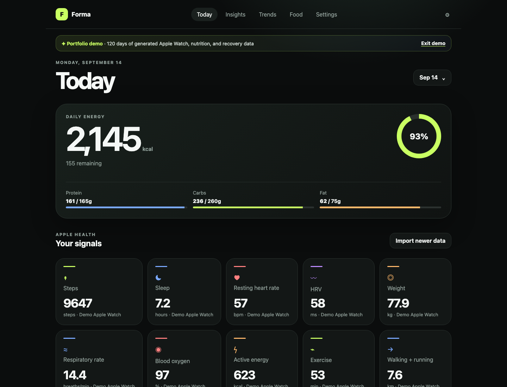
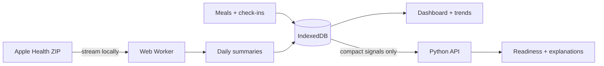

<div align="center">

# Forma

### Your Apple Health data, turned into a daily story.

A local-first health dashboard with Apple Health import, macro tracking, trends, and an explainable personal readiness model written in Python.

[](https://developer.mozilla.org/en-US/docs/Web/JavaScript/Guide/Modules)
[](backend/readiness.py)
[](https://forma-health-git-main-jimmywastaken.vercel.app/?demo=1)
[](#run-it-locally)

**[Explore the generated demo →](https://forma-health-git-main-jimmywastaken.vercel.app/?demo=1)**

</div>



## Why I built it

Health apps often hide how they calculate recovery scores, while Apple Health exports are too large and awkward to explore by hand. Forma turns that export into a useful dashboard and keeps the model small enough to read, test, and understand.

The portfolio demo generates 120 days of realistic data from the current date. Add `?demo=1` to the URL to explore every screen with populated charts, meals, and a trained readiness score. Demo data stays in memory and cannot overwrite personal browser data.

## What it does

- **Apple Health import** — streams large ZIP or XML exports through a Web Worker and summarizes 11 health metrics.
- **Nutrition tracking** — logs meals, servings, calories, protein, carbs, and fat against editable daily targets.
- **Health trends** — compares 7, 30, or 90-day periods with coverage, averages, ranges, and responsive charts.
- **Personal readiness** — trains ridge regression on daily check-ins and explains which signals moved the prediction.
- **Local-first storage** — keeps food, summaries, targets, and check-ins in IndexedDB with validated JSON backup and restore.
- **Responsive interface** — works as a phone-sized daily companion or a desktop dashboard.

## How it fits together



The raw Apple Health export never leaves the browser. Only compact daily HRV, resting heart rate, sleep, respiratory rate, and recovery labels are sent to the stateless Python function when Insights is opened.

## The ML, without a black box

Forma builds a personal baseline from the **previous** 28 days, converts current signals to z-scores, and trains ridge regression to predict the user's 1-to-5 recovery check-in. It excludes the current day from its own baseline and holds out the newest 20% of training days for chronological evaluation.

The model waits for 14 usable check-ins, reports its error beside an average-only baseline, and returns each feature's contribution. The implementation uses plain Python and a commented matrix solver rather than an ML framework, making the full learning pipeline inspectable.

> The readiness score is an educational experiment, not medical advice or a diagnostic tool.

## Run it locally

You need Node.js 20+, Python 3.12+, and the [Vercel CLI](https://vercel.com/docs/cli).

```bash
git clone https://github.com/jaknowles18/forma-health.git
cd forma-health
npm run check
vercel dev
```

Open the URL printed by Vercel. Use `/?demo=1` for the generated portfolio dataset. A basic static server can render the dashboard, but Insights needs the Python function provided by `vercel dev`.

## Import your own health data

1. On iPhone, open **Health → profile picture → Export All Health Data**.
2. In Forma, choose **Import data** and select the resulting ZIP.
3. If a very large ZIP uses ZIP64, extract it and select `apple_health_export/export.xml` instead.
4. Download a JSON backup from Settings before clearing browser data or changing devices.

Supported signals are steps, sleep, resting heart rate, HRV, weight, respiratory rate, blood oxygen, active energy, exercise time, walking/running distance, and VO₂ max.

## Engineering decisions

| Decision | Why | Tradeoff |
|---|---|---|
| Browser-only persistence | Simple, private v1 with no account or database | Data does not automatically follow the user across devices |
| Streaming import in a Web Worker | Large exports do not freeze the main interface | ZIP64 archives need the extracted XML fallback |
| Daily summaries instead of raw samples | Makes charts fast and greatly reduces storage | Fine-grained workout and intraday analysis is unavailable |
| Plain Python ridge regression | Easy to learn, audit, and deploy as one function | Less flexible than a production ML pipeline |
| Generated `?demo=1` dataset | The demo stays current and never ships personal health data | It represents realistic patterns rather than a real person |

These boundaries leave clear extension points for authentication, cloud sync, HealthKit ingestion through an iOS companion, richer nutrition data, and more advanced models without requiring them in v1.

## Project map

```text
dist/
  app.js             UI state and screen flows
  demo-data.js       Deterministic, read-only portfolio dataset
  domain.js          Validation, dates, nutrition, and trends
  import-worker.js   Streaming Apple Health ZIP/XML parser
  insights.js        Compact client for the Python function
  storage.js         IndexedDB and backup/restore
api/readiness.py     Vercel Python Function
backend/
  features.py        Leakage-safe personal baselines
  ridge.py           Commented ridge-regression solver
  readiness.py       Training, evaluation, and explanations
tests/               JavaScript and Python checks
```

Read [the architecture notes](docs/ARCHITECTURE.md) for the data flow, storage model, ML pipeline, limitations, and future extension points.

## Deploy

Import this repository into Vercel. `vercel.json` serves `dist` and Vercel detects `api/readiness.py` as a Python Function. The current version needs no build command, database, API key, or environment variable.

---

<div align="center">
Built as a focused exploration of local-first product design, health-data processing, and understandable machine learning.
</div>
